# DE1 Project assignment - Parking assistant

### Team members
Vladimír Lukáč, Masauso Lungu, Tomáš Marčák, Vít Maša

Link to our GitHub project folder: [Project folder](https://github.com/tmarcak/Digital-electronics-1/tree/main/Labs/project)

### Project objectives

Main objective of the project from the subject Digital electronics was to create a parking assistant with HC-SR04 ultrasonic sensor, sound signaling using PWM, signaling by LED bargraph and this all controled by Arty A7. The sensor measures a distance from 2cm to 4m, but in our project we used measurements only up to 1,5m. All codes, testbenches and simlation are created in Vivado. Desingnes of boards are created in Autodesk Eagle.

# Hardware description

### Arty A7

The Arty A7, formerly known as the Arty, is a ready-to-use development platform designed around the Artix-7™ Field Programmable Gate Array (FPGA) from Xilinx.
It was designed specifically for use as a MicroBlaze Soft Processing System. When used in this context, the Arty A7 becomes the most flexible processing platform you could hope to add to your collection, capable of adapting to whatever your project requires. 
The Arty A7 is fully compatible with the high-performance Vivado ® Design Suite. It is supported under the free WebPACK™ license, so designs can be implemented at no additional cost. 

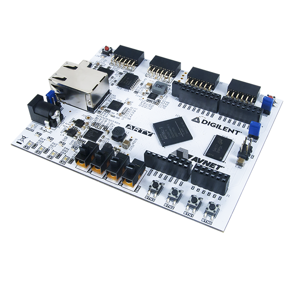

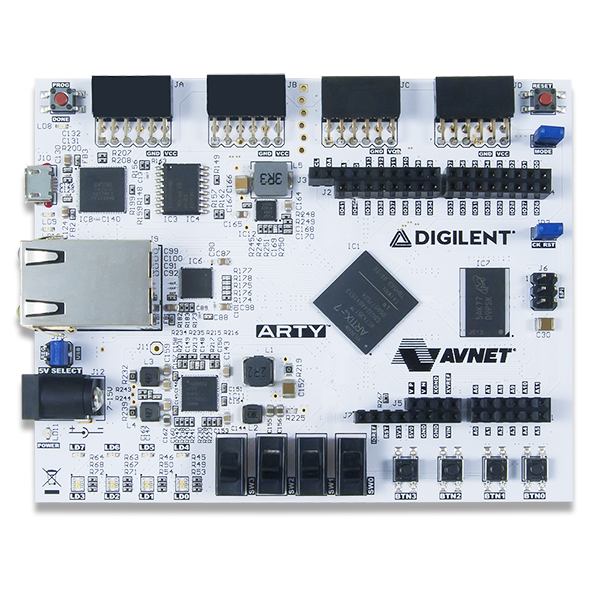

We wanted to use Pmod connectors, but they have only 3.3V VCC and HC-SR04 need to be powered by 5V. So we decided to use Arduino/chipKIT Shield Connector which has two pins with 3.3V VCC and 5.0V VCC outputs.

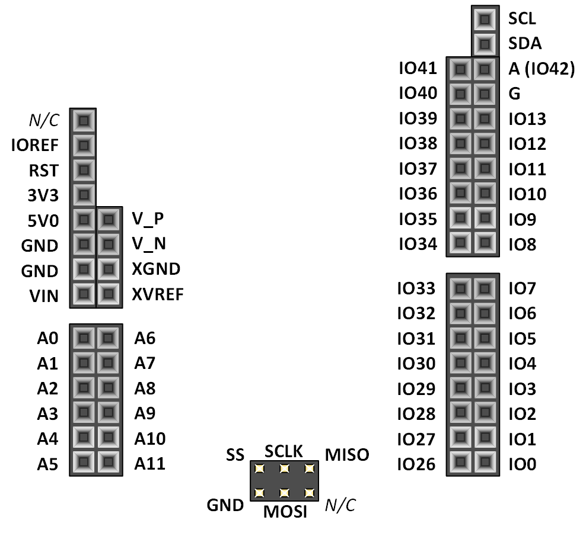

### HC-SR04 ultrasonic sensor

The HC-SR04 ultrasonic sensor uses sonar to determine distance to an object like bats do. 
It offers excellent non-contact range detection with high accuracy and stable readings in an easy-to-use package. 
It comes complete with ultrasonic transmitter and receiver modules. This sensor is very popular among the Arduino tinkerers. 
The sensor expects 10us long pulses, based on which it sends ultrasonic pulses and rigesters their reflection. The sensor returnt an acho pulse with a width corresponding to the distance of blockade from the sensor. Conversion for distance is : echo pulse length / 58. Distance is in cm.

As it is mentioned above, the sensor must be powered by 5V, so we chose to use Arduino/chipKIT Shield Connector which have pin with 5V, so we can powered the sensor from this pin.

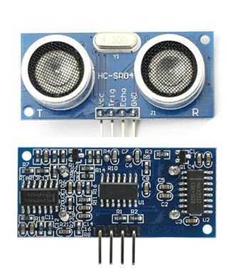

### Board

Our designed board in Eagle software. 

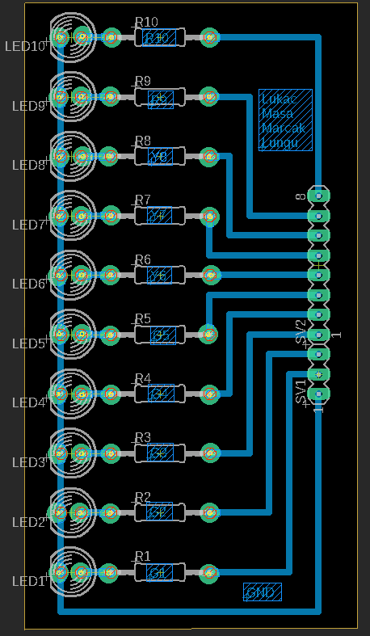

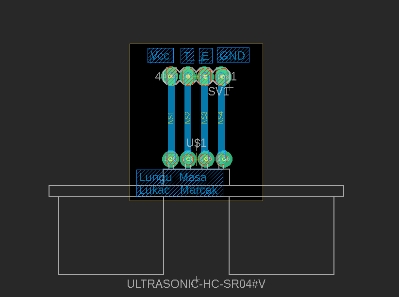

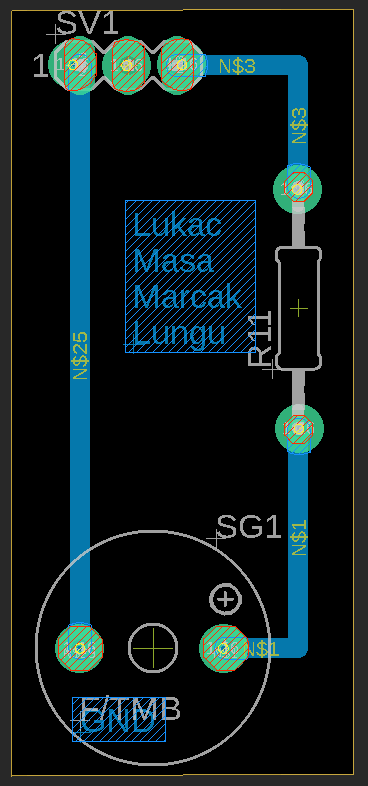

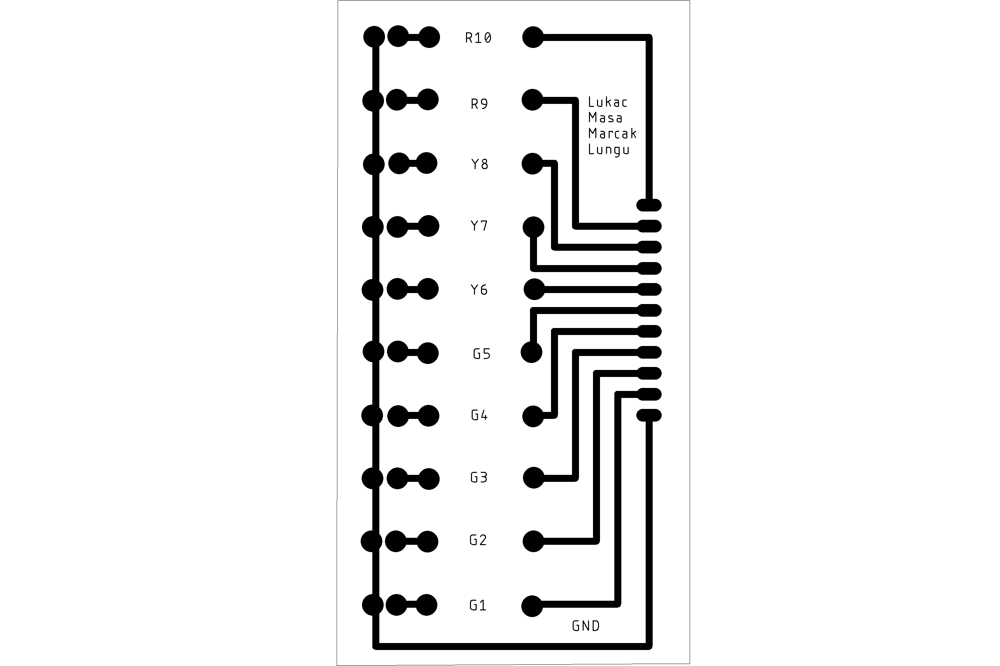

### Buzzer

For sound signalization with PWM we chose simple Piezo Buzzer. 
Piezo buzzers are simple devices that can generate basic beeps and tones.  
They work by using a piezo crystal. It is a special material that changes shape when voltage is applied to it.  
If the crystal pushes against a diaphragm, like a tiny speaker cone, it can generate a pressure wave which the human ear picks up as sound.  
Simple change the frequency of the voltage sent to the piezo and it will start generating sounds by changing shape very quickly!

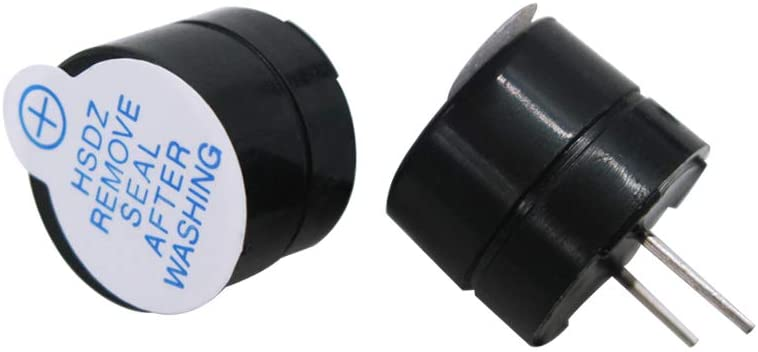

### LED bargraph
As visual signalization we chose 10 segment LED bargraph, where are 5 green segment which signalizated there is lots of free space (1,5m - 0,5m), 3 yellow segment (0,5m - 0,2m) and 2 red segments (0,2m - 0m) which signalizated there is not enought space and you have to stop or you can crash your car. We decided to make first green LED glow when car distance is between 1,5m and 1,2m and second if you reach 1,2m because you have to let 1,2m space when you are parking next to car for handicapped.

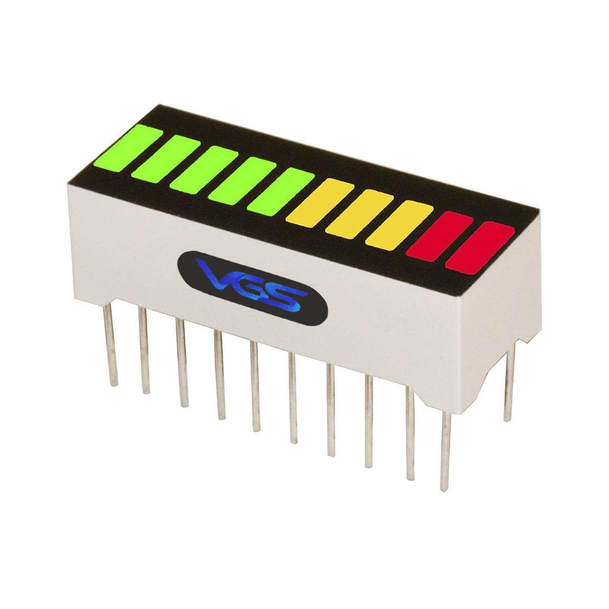

### Pin cables

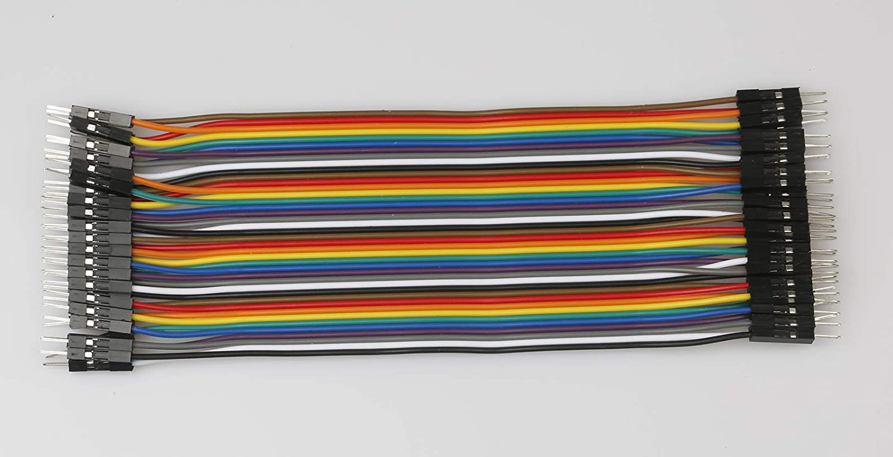

## VHDL modules description and simulations

### HC-SR04 Ultrasonic sensor

The sensor control is divided into two blocks `Sensor_control_unit` and `Sensor_logic_unit`.

### Sensor_control_unit

The `Sensor_control_unit` module directly controls the HC-SR04 sensor. It emits an appropriately long pulse and calculates the response.

#### Code for `Sensor_control_unit`

```vhdl
entity Sensor_control_unit is
    Port ( 
    CLK100MHZ    : in STD_LOGIC;
    puls_i       : in STD_LOGIC;
    echo_i       : in STD_LOGIC;
    trigger_o    : out STD_LOGIC;
    time_o       : out natural
    );
end Sensor_control_unit;

architecture Behavioral of Sensor_control_unit is
    signal s_count_local    : natural;
    signal s_time           : natural;
    signal local_reset      : std_logic;
    signal s_time_o         : natural;
    
begin
    sensor_puls: process (CLK100MHZ, puls_i)            -- Creating puls for sensor with 10us periode
    begin
        if rising_edge(CLK100MHZ) then                  -- Synchronous process
            if (puls_i = '1') then
                local_reset <= '1';
            end if;  
            if (local_reset = '1') then                 -- High active reset
                s_count_local <= 0;                     -- Clearing local counter
                trigger_o     <= '1';                   -- Genetating puls
                local_reset   <= '0';                   -- Finishing event
            elsif (s_count_local >= (1000 - 1)) then    -- 1000 clk = 10us
                -- s_count_local <= 0;                  -- Clearing local counter
                trigger_o      <= '0';                  -- End of pulse
            else
                s_count_local <= s_count_local + 1;
                -- trigger_o        <= '1';
            end if;
        end if;
    end process sensor_puls;
    
    
    echo_count: process (CLK100MHZ, echo_i)
    begin    
        if (echo_i = '1') then                          -- High active reset
            s_time   <= 0;                              -- Clearing local counter
            s_time_o <= 0;
            time_o   <= 0;
        else
            time_o <= s_time_o;
        end if;
        
        if rising_edge(CLK100MHZ) then                  -- Synchronous process
            if (s_time >= 5800-1) then
                s_time_o <= s_time_o + 1;
                -- time_o <= s_time_o;
                s_time <= 0; 
            else 
                s_time <= s_time + 1;
            end if;
        end if;
    end process echo_count;
end Behavioral;
```
#### Testbench for `Sensor_control_unit`

```vhdl
architecture testbench of tb_Sensor_control_unit is
    constant c_CLK_100MHZ_PERIOD : time := 10 ns;
    
    -- Local signals    
    signal s_clk        : std_logic;
    signal s_puls       : std_logic;
    signal s_echo       : std_logic := '0';
    signal s_trigger    : std_logic;
    signal s_time_o     : natural;
     
begin
    uut_Sensor_control_unit : entity work.Sensor_control_unit
    port map(
            CLK100MHZ    => s_clk,
            puls_i       => s_puls,
            echo_i       => s_echo,
            trigger_o    => s_trigger,
            time_o       => s_time_o
        );
        
        
    p_clk_gen : process
   
    begin
        while now < 2000000000 ns loop          -- 75 periods of 100MHz clock
            s_clk <= '0';
            wait for c_CLK_100MHZ_PERIOD / 2;
            s_clk <= '1';
            wait for c_CLK_100MHZ_PERIOD / 2;
        end loop;
        wait;                                   -- Process is suspended forever
    end process p_clk_gen;
    
    p_sensor_puls : process
    begin
        while now < 2000000000 ns loop          -- 75 periods of 100MHz clock
            s_puls <= '0';
            wait for 50ns;
            s_puls <= '1';
            wait for (20ms - 50ns);
        end loop;
        wait;                                   -- Process is suspended forever
    end process p_sensor_puls;
    
    p_sensor_echo : process
    variable seed1, seed2: positive;              -- Values for random generator
    variable rand: real;                          -- Random real-number value in range 0 to 1,5m  
    variable range_of_rand : real := 600000.0;    -- The range of random created values will be by 0 to +1000
   
    begin
        wait until (s_puls = '1');
        wait for 7540 us; -- 130cm
        s_echo <= '1';
        wait for 7540 us;
        s_echo <= '0';
        wait until (s_puls = '1');
        wait for 6902 us; -- 119cm
        s_echo <= '1';
        wait for 6902 us;
        s_echo <= '0';
        wait until (s_puls = '1');
        wait for 6090 us; -- 105cm
        s_echo <= '1';
        wait for 6090 us;
        s_echo <= '0';
        wait until (s_puls = '1');
        wait for 5510 us; -- 95cm
        s_echo <= '1';
        wait for 5510 us;
        s_echo <= '0';
        wait until (s_puls = '1');
        wait for 4582 us; -- 79cm
        s_echo <= '1';
        wait for 4582 us;
        s_echo <= '0';
        wait until (s_puls = '1');
        wait for 3480 us; -- 60cm
        s_echo <= '1';
        wait for 3480 us;
        s_echo <= '0';
        wait until (s_puls = '1');
        wait for 2262 us; -- 39cm
        s_echo <= '1';
        wait for 2262 us;
        s_echo <= '0';
        wait until (s_puls = '1');
        wait for 1682 us; -- 29cm
        s_echo <= '1';
        wait for 1682 us;
        s_echo <= '0';
        wait until (s_puls = '1');
        wait for 1102 us; -- 19cm
        s_echo <= '1';
        wait for 1102 us;
        s_echo <= '0';
        wait until (s_puls = '1');
        wait for 522 us; -- 9cm
        s_echo <= '1';
        wait for 522 us;
        s_echo <= '0';
        
        wait;
    end process p_sensor_echo;
end testbench;
```

#### Simulation waveforms for `Sensor_control_unit`

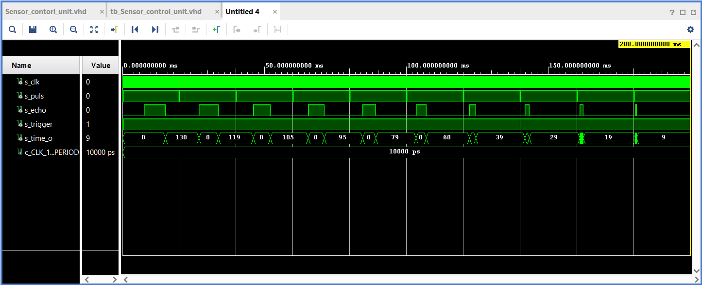

### Sensor_logic_unit

The `Sensor_logic_unit` module controls when the pulse is sent to the sensor and processes the returned distance. Module converts returned distance to 10 levels, which are sent to `Buzzer_control_unit` and `LED_bar_control_unit` modules.

#### Code for `Sensor_logic_unit`

```vhdl
entity Sensor_logic_unit is
    Port ( 
    enable_i     : in STD_LOGIC;
    CLK100MHZ    : in STD_LOGIC;
    sensi_i      : in natural;
    sensi_o      : out STD_LOGIC := '0';
    distance_o   : out std_logic_vector(4 - 1 downto 0) := "1111"
    );
end Sensor_logic_unit;

architecture Behavioral of Sensor_logic_unit is
    signal clk            : std_logic;
    signal s_count_local  : natural;
    
begin
    
    p_sensor_clok: process (CLK100MHZ)                 -- Creating freqency for distanc measuring
   
    begin
        if rising_edge(CLK100MHZ) then                 -- Synchronous process
            if (s_count_local >= (50000000 - 1)) then
                s_count_local <= 0;                    -- Clear local counter
                clk           <= '1';                  -- Generate clock enable pulse

            else
                s_count_local <= s_count_local + 1;
                clk           <= '0';
            end if;
        end if;
    end process p_sensor_clok;
    
    
    p_sensor_enable: process (clk, enable_i)           -- Clutch implementation 
                                                       -- Sensor works only if clutch activated - enable_i = 1
    begin
        if (enable_i = '1') then
            if (clk = '1') then
                sensi_o <= '1';                        -- Puls
            else
                sensi_o <= '0';
            end if;
        end if;    
    end process p_sensor_enable;
    
    
    p_sensor_logic: process (sensi_i)                   -- Clasifying to levels for other units to 10 levels
    
    begin
        if (sensi_i < 5) then
            report "Car is too close!";
        elsif ((sensi_i) <= 10) then
            distance_o <= "0000";
        elsif ((sensi_i) <= 20) then
            distance_o <= "0001";
        elsif ((sensi_i) <= 30) then
            distance_o <= "0010";
        elsif ((sensi_i) <= 40) then
            distance_o <= "0011";
        elsif ((sensi_i) <= 50) then
            distance_o <= "0100";
        elsif ((sensi_i) <= 60) then
            distance_o <= "0101";
        elsif ((sensi_i) <= 80) then
            distance_o <= "0110";
        elsif ((sensi_i) <= 100) then
            distance_o <= "0111";
        elsif ((sensi_i) <= 120) then
            distance_o <= "1000";
        elsif ((sensi_i) <= 150) then
            distance_o <= "1001";
        else
            report "Car is too far";    
        end if;
    end process p_sensor_logic;

end Behavioral;
```

#### Testbench for `Sensor_logic_unit`

```vhdl
architecture testbench of tb_Sensor_logic_unit is
    constant c_CLK_100MHZ_PERIOD : time    := 10 ns;
    
    signal s_clk        : std_logic;
    signal s_enable     : std_logic;
    signal s_sensi_i    : natural;
    signal s_sensi_o    : std_logic;
    signal s_distance   : std_logic_vector(4 - 1 downto 0) := "1111";
    
begin
    uut_sensor : entity work.Sensor_logic_unit
    port map(
            CLK100MHZ   => s_clk,
            enable_i    => s_enable,
            sensi_i     => s_sensi_i,
            sensi_o     => s_sensi_o,
            distance_o  => s_distance
        );

    p_clok_gen : process
    begin
        while now < 2000000000 ns loop         -- 75 periods of 100MHz clock
            s_clk <= '0';
            wait for c_CLK_100MHZ_PERIOD / 2;
            s_clk <= '1';
            wait for c_CLK_100MHZ_PERIOD / 2;
        end loop;
        wait;                                  -- Process is suspended forever
    end process p_clok_gen;
    
    p_enable : process
    begin
        s_enable <= '1'; 
        wait for 2000 ms;
        s_enable <= '0'; 
        wait;
    end process p_enable;
    
    p_tb_sensor_logic : process
    begin
        wait until (s_sensi_o = '1');
        s_sensi_i <= 130;
        wait until (s_sensi_o = '1');
        s_sensi_i <= 110;
        wait until (s_sensi_o = '1');
        s_sensi_i <= 90;
        wait until (s_sensi_o = '1');
        s_sensi_i <= 79;
        wait until (s_sensi_o = '1');
        s_sensi_i <= 50;
        wait until (s_sensi_o = '1');
        s_sensi_i <= 20;
    end process p_tb_sensor_logic;
end testbench;
```

#### Simulation waveforms for `Sensor_logic_unit`

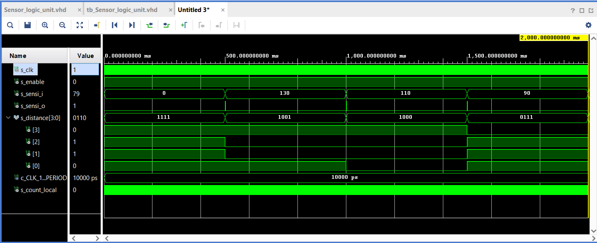

### Buzzer

### Buzzer_control_unit

The `Buzzer_control_unit` module has 3 inputs and one output. First input is enable signal which determines if module is functional or not. Second input is distance level from `Sensor_logic_unit` represented by 4-bit logic vector. Third input is a 100MHz clock signal. The output is PWM modulated waveform for piezo buzzer. Architecture of module is created by two sequentinal processes. First process `p_clk` secured clock and second process `p_buzzer` make PWM modulation. First it checks if enable signal is ON and when it is ON then it determines distance level and starts appropriate couter with proper pulse width.

#### Code for `Buzzer_control_unit`

```vhdl
entity Buzzer_control_unit is
    Port ( 
    enable_i            : in   std_logic;
    CLK100MHZ           : in   std_logic;
    distance_i          : in   std_logic_vector(4 - 1 downto 0);
    buzzer_o            : out  std_logic
    );
end Buzzer_control_unit;

architecture Behavioral of Buzzer_control_unit is
---------------------------------------------------
-- internal signals 
signal clk              : std_logic;
signal s_buzzer         : std_logic;
signal s_counter_clk    : natural;
signal s_counter        : natural :=0;


begin

    p_clk: process (CLK100MHZ)
    begin
        if rising_edge(CLK100MHZ) then
            if (s_counter_clk >= 10) then
                s_counter_clk <=  0;
                clk           <= '1';
            else
                s_counter_clk <= s_counter_clk + 1;
                clk           <= '0';
            end if;
        end if;
    end process p_clk;
    
    p_buzzer : process(clk)
    begin
            if (enable_i = '1')then
                case distance_i is
                    -- 0m-0,1m
                    when "0000" =>
                        buzzer_o <= '1';
                    -- 0,1m-0,2m
                    when "0001" =>
                    if rising_edge(clk)then
                        if (s_counter >= 1) then
                            s_counter <= 0;       
                            buzzer_o  <= '1'; 
                        else
                            s_counter <= s_counter + 1;
                            buzzer_o  <= '0';
                        end if;
                    end if;
                    -- 0,2m-0,3m
                    when "0010" =>
                    if rising_edge(clk)then
                        if (s_counter >= 2) then
                            s_counter <= 0;       
                            buzzer_o  <= '1'; 
                        else
                            s_counter <= s_counter + 1;
                            buzzer_o  <= '0';
                        end if;
                    end if;
                    -- 0,3m-0,4m
                    when "0011" =>
                    if rising_edge(clk)then
                        if (s_counter >= 3) then
                            s_counter <= 0;       
                            buzzer_o  <= '1'; 
                        else
                            s_counter <= s_counter + 1;
                            buzzer_o  <= '0';
                        end if;
                    end if;
                    -- 0,4m-0,5m
                    when "0100" =>
                    if rising_edge(clk)then
                        if (s_counter >= 4) then
                            s_counter <= 0;       
                            buzzer_o  <= '1'; 
                        else
                            s_counter <= s_counter + 1;
                            buzzer_o  <= '0';
                        end if;
                    end if;
                    -- 0,5m-0,6m
                    when "0101" =>
                    if rising_edge(clk)then
                        if (s_counter >= 5) then
                            s_counter <= 0;       
                            buzzer_o  <= '1'; 
                        else
                            s_counter <= s_counter + 1;
                            buzzer_o  <= '0';
                        end if;
                    end if;
                    -- 0,6m-0,8m
                    when "0110" =>
                    if rising_edge(clk)then
                        if (s_counter >= 6) then
                            s_counter <= 0;       
                            buzzer_o  <= '1'; 
                        else
                            s_counter <= s_counter + 1;
                            buzzer_o  <= '0';
                        end if;
                    end if;
                    -- 0,8m-1m
                    when "0111" =>
                    if rising_edge(clk)then
                        if (s_counter >= 7) then
                            s_counter <= 0;       
                            buzzer_o  <= '1'; 
                        else
                            s_counter <= s_counter + 1;
                            buzzer_o  <= '0';
                        end if;
                    end if;
                    -- 1m-1,2m
                    when "1000" =>
                    if rising_edge(clk)then
                        if (s_counter >= 8) then
                            s_counter <= 0;       
                            buzzer_o  <= '1'; 
                        else
                            s_counter <= s_counter + 1;
                            buzzer_o  <= '0';
                        end if;
                    end if;
                    -- 1,2m-1,5m
                    when others =>
                        buzzer_o <= '0';
                end case;
            else
                buzzer_o <= '0';
            end if;
    end process p_buzzer;    
end Behavioral;
```

#### Testbench for `Buzzer_control_unit`

```vhdl
rchitecture Behavioral of tb_Buzzer_control_unit is

    constant clk_period     : time :=10ms;
    
    signal s_clk            : std_logic;
    signal s_enable         : std_logic;
    signal s_distance       : std_logic_vector(4 - 1 downto 0);
    signal s_pwm            : std_logic;
    
begin
    
    uut_Buzzer_control_unit : entity work.Buzzer_control_unit
        port map(
            CLK100MHZ      => s_clk,
            enable_i      => s_enable,
            distance_i    => s_distance,
            buzzer_o      => s_pwm
        );
        
    p_clk : process
    begin
        while now < 46000 ms loop         
            s_clk <= '0';
            wait for clk_period / 2;
            s_clk <= '1';
            wait for clk_period / 2;
        end loop;
        wait;
    end process p_clk;
    
    p_test : process
    begin
        s_enable   <= '1';
        -- 1,5m-1,2m
        s_distance <= "1001";
        wait for 2000ms;
        -- 1,2m-1m
        s_distance <= "1000";
        wait for 2000ms;
        -- 1m-0,8m
        s_distance <= "0111";
        wait for 2000ms;
        -- 0,8m-0,6m
        s_distance <= "0110";
        wait for 2000ms;
        -- 0,6m-0,5m
        s_distance <= "0101";
        wait for 2000ms;
        -- 0,5m-0,4m
        s_distance <= "0100";
        wait for 2000ms;
        -- 0,4m-0,3m
        s_distance <= "0011";
        wait for 2000ms;
        -- 0,3m-0,2m
        s_distance <= "0010";
        wait for 2000ms;
        -- 0,2m-0,1m
        s_distance <= "0001";
        wait for 2000ms;
        -- 0,1m-0m
        s_distance <= "0000";
        wait for 2000ms;
        -- 1m-0,8m
        s_distance <= "0001";
        wait for 2000ms;
        -- 1,2m-1m
        s_distance <= "0010";
        wait for 2000ms;
        -- 1,4m-1,2m
        s_distance <= "0011";
        wait for 2000ms;
        -- 1,6m-1,4m
        s_distance <= "0100";
        wait for 2000ms;
        -- 1,4m-1,6m
        s_distance <= "0101";
        wait for 2000ms;
        -- 1,6m-1,8m
        s_distance <= "0110";
        wait for 2000ms;
        -- 2m-1,8m
        s_distance <= "0111";
        wait for 2000ms;
        -- 2,2m-2m
        s_distance <= "1000";
        wait for 2000ms;
        -- 3m-2,4m
        s_distance <= "1001";
        wait for 2000ms;
        s_enable       <= '0';
        -- 2,4-2,2m
        s_distance <= "1000";
        wait for 2000ms;
        -- 2,2m-2m
        s_distance <= "0111";
        wait for 2000ms;
        -- m-m
        s_distance <= "0110";
        wait;
    end process p_test;
end Behavioral;
```

#### Simulation waveforms for `Buzzer_control_unit`

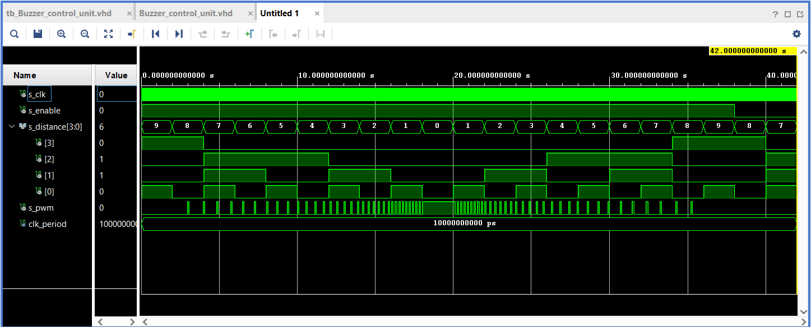

### LED bar graph

### LED_bar_control_unit

The `LED_bar_control_unit` module has 2 inputs and 1 output. First input is enable signal, which determines if module is functional or not. Second input is distance level from `Sensor_logic_unit` represented by 4-bit logic vector. The output is 10-bit logic vector, 1-bit for 1 level of distance, which is send to LED bar graph. Process in this module is simple. First it checks if enable signal is ON and when it is ON then determine distance level and light up the specific LEDs. If enable signal is OFF then it switch OFF all the LEDs.

#### Code for `LED_bar_control_unit`

```vhdl
entity LED_bar_control_unit is
  Port (
  enable_i      : in   std_logic;
  distance_i    : in   std_logic_vector(4 - 1 downto 0);
  LED_bar_o     : out  std_logic_vector(10 - 1 downto 0)
  );
end LED_bar_control_unit;

architecture Behavioral of LED_bar_control_unit is

begin

   -- p_LED_bar : Sensor_logic_unit port map(enable_i, CLK100MHZ, sensi_i, sensi_o, s_distance);
    p_LED_bar :process(distance_i, enable_i)
    begin
        if (enable_i = '1')then
            case distance_i is
                when "0000" =>
                    -- 0,1m-0m all leds ON
                    LED_bar_o <= "1111111111";
                when "0001" =>
                    -- 0,2m-0,1m first red ON
                    LED_bar_o <= "1111111110";
                when "0010" =>
                    -- 0,3m-0,2m thirds yellow ON
                    LED_bar_o <= "1111111100";
                when "0011" =>
                    -- 0,4m-0,3m second yellow ON
                    LED_bar_o <= "1111111000";
                when "0100" =>
                    -- 0,5m-0,4m first yellow ON
                    LED_bar_o <= "1111110000";
                when "0101" =>
                    -- 0,6m-0,5 5th green ON
                    LED_bar_o <= "1111100000";
                when "0110" =>
                    -- 0,8m-0,6m 4th green ON
                    LED_bar_o <= "1111000000";
                when "0111" =>
                    -- 1m-0,8m thirds green ON
                    LED_bar_o <= "1110000000";
                when "1000" =>
                    -- 1,2m-1m second green ON
                    LED_bar_o <= "1100000000";
                when "1001" =>
                    -- 1,5m-1,2m first green ON
                    LED_bar_o <= "1000000000";
                when others =>
                    -- All leds OFF
                    LED_bar_o <= "0000000000";
            end case;
        else
            LED_bar_o <= "0000000000";
        end if;
    end process p_LED_bar;
end Behavioral;
```

#### Testbench for `LED_bar_control_unit`

```vhdl
architecture Behavioral of tb_LED_bar_control_unit is

    signal s_distance       : std_logic_vector(4 - 1 downto 0);
    signal s_enable         : std_logic;
    signal s_LED_bar        : std_logic_vector(10 - 1 downto 0);
    
begin

    uut_LED_bar : entity work.LED_bar_control_unit
        port map(
            distance_i      => s_distance,
            enable_i        => s_enable,
            LED_bar_o       => s_LED_bar
            );
            
    p_stimulus : process
    begin
        report "Stimulus process started correctly" severity note;
        s_enable <= '1';
        -- 1,5m-1,2m
        s_distance <= "1001";
        wait for 100ns;
        -- 1,2m-1m
        s_distance <= "1000";
        wait for 100ns;
        -- 1m-0,8m
        s_distance <= "0111";
        wait for 100ns;
        -- 0,8m-0,6m
        s_distance <= "0110";
        wait for 100ns;
        -- 0,6m-0,5m
        s_distance <= "0101";
        wait for 100ns;
        -- 0,5m-0,4m
        s_distance <= "0100";
        wait for 100ns;
        -- 0,4m-0,3m
        s_distance <= "0011";
        wait for 100ns;
        -- 0,3m-0,2m
        s_distance <= "0010";
        wait for 100ns;
        -- 0,2m-0,1m
        s_distance <= "0001";
        wait for 100ns;
        -- 0,1m-0m
        s_distance <= "0000";
        wait for 100ns;
        
        -- Sensor disabled
        s_enable <= '0';
        -- 0,3m-0,2m
        s_distance <= "0010";
        wait for 100ns;
        -- 0,2m-0,1m
        s_distance <= "0001";
        wait for 100ns;
        -- 0,1m-0m
        s_distance <= "0000";
        wait for 100ns;
        
        report "Stimulus process finished correctly" severity note;
        wait;
        
    end process p_stimulus;
end Behavioral;
```

#### Simulation waveforms for `LED_bar_control_unit`

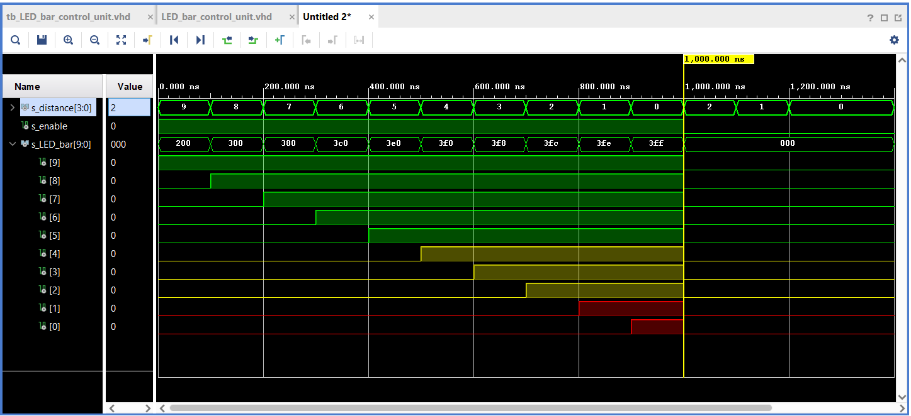

# TOP module description and simulations

#### Code for `Top module`

```vhdl
entity Top_parking_assistant is
    Port ( 
          CLK100MHZ  : in  std_logic;                       -- for fgpa 100MHz clock
          --BTN        : in  std_logic_vector(1-1 downto 0);  -- for reset
          SW         : in  std_logic;                       --for enable
          echo       : in  std_logic;
          ck_io      : out std_logic_vector(10-1 downto 0); --output led
          trigger    : out std_logic;
          Buzzer     : out std_logic                        --audio output pin
    );
end Top_parking_assistant;

 

------------------------------------------------------------------------
-- Architecture body for top level
------------------------------------------------------------------------
architecture Behavioral of Top_parking_assistant is
-- inernal signals 
    signal s_pulse    : std_logic;    -- for puls_i and sensi_o
    signal s_distance : std_logic_vector(4-1 downto 0);
    signal s_time     : natural;
    
begin

 

    --------------------------------------------------------------------
    -- Instance (copy) of sensor_contrl_unit entity
    --------------------------------------------------------------------
    Sensor_control_unit : entity work.Sensor_control_unit
        port map(
             CLK100MHZ => CLK100MHZ,
             echo_i    => echo,
             puls_i    => s_pulse,
             time_o    => s_time,
             trigger_o => trigger
             
             );
    --------------------------------------------------------------------
    -- Instance (copy) of sensor_logic_unit entity
    --------------------------------------------------------------------
    Sensor_logic_unit : entity work.Sensor_logic_unit
        port map(
             CLK100MHZ  => CLK100MHZ,
             enable_i   => SW,
             sensi_i    => s_time,
             sensi_o    => s_pulse,
             distance_o => s_distance
             
             );
             
    --------------------------------------------------------------------
    -- Instance (copy) of sensor_logic_unit entity
    --------------------------------------------------------------------
    LEDs : entity work.LED_bar_control_unit
        port map(
             enable_i     => SW,
             distance_i   => s_distance,
             LED_bar_o(0) => ck_io(0),  --red
             LED_bar_o(1) => ck_io(1),
             LED_bar_o(2) => ck_io(2),  --yellow
             LED_bar_o(3) => ck_io(3),
             LED_bar_o(4) => ck_io(4),  
             LED_bar_o(5) => ck_io(5),  --green
             LED_bar_o(6) => ck_io(6),
             LED_bar_o(7) => ck_io(7),
             LED_bar_o(8) => ck_io(8),  
             LED_bar_o(9) => ck_io(9)
             
             );
     
     --------------------------------------------------------------------
    -- Instance (copy) of Buzzer_unit entity
    --------------------------------------------------------------------
    Buzzer_unit : entity work.Buzzer_control_unit
        port map(
             enable_i   => SW,
             CLK100MHZ  => CLK100MHZ,
             distance_i => s_distance,
             buzzer_o   => Buzzer
             
             );        

 

end Behavioral;
```

#### Testbench for `Top module`

```vhdl
architecture Behavioral of tb_top is
    constant c_CLK100MHZ : time :=10 ns;  -- period of the fpga
    
    signal s_clk     : std_logic;
    signal s_sw      : std_logic;
    signal s_btn     : std_logic_vector(1-1 downto 0);
    signal s_echo    : std_logic;
    signal s_ck_io   : std_logic_vector(10-1 downto 0);
    signal s_trigger : std_logic;
    signal s_buzzer  : std_logic;
    

 

begin
    uut_top : entity work.Top_parking_assistant
        port map(
            CLK100MHZ => s_clk,
            SW        => s_sw,
            --BTN(0)    => s_btn(0),
            echo      => s_echo,
            ck_io     => s_ck_io,
            trigger   => s_trigger,
            Buzzer    => s_buzzer
            );
    
    p_clk_gen : process
    begin 
        while now < 10000 ms loop
            s_clk <= '0';
            wait for c_CLK100MHZ / 2;
            s_clk <= '1';
            wait for c_CLK100MHZ / 2;
            
        end loop;
        wait;
    end process p_clk_gen;
    
     p_stimulus : process
    begin
        s_sw    <= '1';
        wait;       
    end process p_stimulus;
            
end Behavioral;
```

#### Simulation waveforms for `Top module`


## Top module diagram

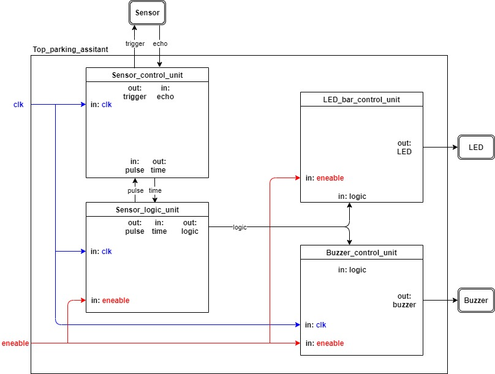

## Tables

### Table for input/output ports

| **Port name** | **Direction** | **Type** | **Description** |
| :-: | :-: | :-: | :-: | :-: |
| `CLK100MHz` | input | `std_logic` | Main clock |
| `SW` | input | `std_logic` | Enable switch |
| `echo` | input | `std_logic` | Echo signal |
| `ck_io` | output | `std_logic_vector(10-1 downto 0)` | LED bar signals |
| `trigger` | output | `std_logic` | Trigger signal |
| `Buzzer` | output | `std_logic` | Buzzer audio signal |

### Table for ports & pins

| **Port name** | **Pin** | **Description** |
| :-: | :-: | :-: | :-: |
| `CLK100MHz` | E3 | Main clock |
| `SW` | A8 | Enable switch |
| `echo` | P17 | Echo signal |
| `trigger` | R17 | Trigger signal |
| `Buzzer` | P17 | Buzzer audio signal |
| `ck_io[0]` | V15 | LED Red |
| `ck_io[1]` | U16 | LED Red |
| `ck_io[2]` | P14 | LED Yellow |
| `ck_io[3]` | T11 | LED Yellow |
| `ck_io[4]` | R12 | LED Yellow |
| `ck_io[5]` | T14 | LED Yellow |
| `ck_io[6]` | T15 | LED Green |
| `ck_io[7]` | T16 | LED Green |
| `ck_io[8]` | N15 | LED Green |
| `ck_io[9]` | M16 | LED Green |

## Video

Link to Youtube video of our project: [Video](https://www.youtube.com/watch?v=5jJb18Ru17U)

## References

   1. Arty A7 board description. In: digilentinc.com [online]. Available here: [Arty A7](https://reference.digilentinc.com/reference/programmable-logic/arty-a7/reference-manual) 
   2. HC-SR04 ultrasonic sensor description. In: randomnerdtutorials.com [online]. Available here: [HC-SR04](https://randomnerdtutorials.com/complete-guide-for-ultrasonic-sensor-hc-sr04/) 
   3. LED bar grapg image. In: amazon.com [online]. Available here: [LED bar graph](https://www.amazon.com/Single-Segment-Display-Colors-Arduino/dp/B07BJ8ZGP7)
   4. Buzzer image. In: amazon.com [online]. Available here: [Buzzer](https://www.amazon.com/mxuteuk-Electronic-Computers-Printers-Components/dp/B07VK1GJ9X/ref=sr_1_3?dchild=1&keywords=passive+piezo+buzzer+3%2C3V&qid=1619639466&sr=8-3)
   5. Pin cabels image. In: amazon.com [online]. Available here: [Pin cabels](https://www.amazon.com/EDGELEC-Breadboard-Optional-Assorted-Multicolored/dp/B07GD1XFWV/ref=sr_1_3?dchild=1&keywords=pin+cables&qid=1619639534&sr=8-3)
   6. Study materials. In: secs.oakland.edu [online]. Available here: [Study materials](https://www.secs.oakland.edu/~llamocca/Courses/ECE4710/W20/FinalProject/Group2_ultrasound2audio.pdf)
   7. Study materials and previous expirience. In: github.com [online]. Available here: [Study materials](https://github.com/tomas-fryza/Digital-electronics-1)